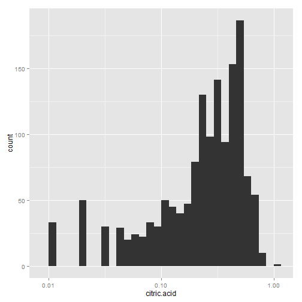
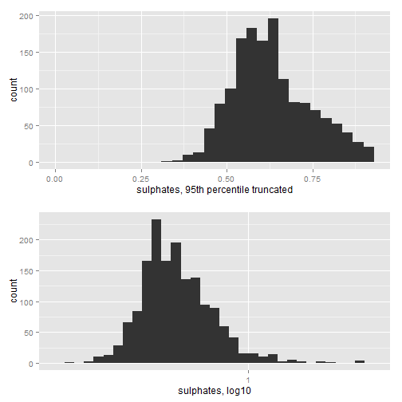

Exploration of Red Wine Quality dataset 
========================================================
## by Dipesh Kumar Singh


## Understanding Dataset

This dataset is public available for research. 
The details are described in [Cortez et al., 2009]. 
The paper is available [here] http://repositorium.sdum.uminho.pt/bitstream/1822/10029/1/wine5.pdf

The inputs were subjected to objective tests and the output is based on sensory analysis (median of at least 3 evaluations made by wine experts). Each expert graded the wine quality between 0 (very bad) and 10 (very excellent).


There are many factors which contributes to taste and quality of wine. In this exercise I will examine 11 variables on the properties of wine. This data set contains 1,599 red wines with 11 variables on the chemical properties of the wine. 

### Input variables (based on physicochemical tests):
*   1 - fixed acidity (tartaric acid - g / dm^3)
*   2 - volatile acidity (acetic acid - g / dm^3)
*   3 - citric acid (g / dm^3)
*   4 - residual sugar (g / dm^3)
*   5 - chlorides (sodium chloride - g / dm^3
*   6 - free sulfur dioxide (mg / dm^3)
*   7 - total sulfur dioxide (mg / dm^3)
*   8 - density (g / cm^3)
*   9 - pH
*   10 - sulphates (potassium sulphate - g / dm3)
*   11 - alcohol (% by volume)

### Description of Variables

   1 - fixed acidity: Acids are major wine constituents that is fixed or nonvolatile.

   2 - volatile acidity: The amount of Acetic acid in wine, which at too high of levels can lead to an unpleasant, like reminiscent of vinegar, rotten-apples.

   3 - citric acid: found in small quantities, citric acid can add 'freshness' and flavor to wines and will effectively make a wine more acidic.

   4 - residual sugar: Any natural grape sugars that are leftover after fermentation ceases, it's rare to find wines with less than 1 g/liter and wines with greater than 45 g/liter are considered sweet

   5 - chlorides: the amount of salt in the wine

   6 - free sulfur dioxide: The free form of SO2 exists in equilibrium between molecular SO2 (as a dissolved gas) and bisulfite ion; it prevents microbial growth and the oxidation of wine

   7 - total sulfur dioxide: amount of free and bound forms of S02; in low concentrations, SO2 is mostly undetectable in wine, but at free SO2 concentrations over 50 ppm, SO2 becomes evident in the nose and taste of wine

   8 - density: the density of water is close to that of water depending on the percent alcohol and sugar content

   9 - pH: describes how acidic or basic a wine is on a scale from 0 (very acidic) to 14 (very basic); most wines are between 3-4 on the pH scale

   10 - sulphates: a wine additive which can contribute to sulfur dioxide gas (S02) levels, wich acts as an antimicrobial and antioxidant

   11 - alcohol: the percent alcohol content of the wine

   Output variable (based on sensory data): 
   12 - quality (score between 0 and 10)

In this project i will try to explore physicochemical input variables, identify correlation, detect outliers and discover interesting relationship in this data to identify chemical properties that influence the quality of red wines.

## Initial Exploration
Let's run some commands to learn structure and schema of the dataset.

```
##   X fixed.acidity volatile.acidity citric.acid residual.sugar chlorides
## 1 1           7.4             0.70        0.00            1.9     0.076
## 2 2           7.8             0.88        0.00            2.6     0.098
## 3 3           7.8             0.76        0.04            2.3     0.092
## 4 4          11.2             0.28        0.56            1.9     0.075
## 5 5           7.4             0.70        0.00            1.9     0.076
## 6 6           7.4             0.66        0.00            1.8     0.075
##   free.sulfur.dioxide total.sulfur.dioxide density   pH sulphates alcohol
## 1                  11                   34  0.9978 3.51      0.56     9.4
## 2                  25                   67  0.9968 3.20      0.68     9.8
## 3                  15                   54  0.9970 3.26      0.65     9.8
## 4                  17                   60  0.9980 3.16      0.58     9.8
## 5                  11                   34  0.9978 3.51      0.56     9.4
## 6                  13                   40  0.9978 3.51      0.56     9.4
##   quality
## 1       5
## 2       5
## 3       5
## 4       6
## 5       5
## 6       5
```

```
##         X fixed.acidity volatile.acidity citric.acid residual.sugar
## 1594 1594           6.8            0.620        0.08            1.9
## 1595 1595           6.2            0.600        0.08            2.0
## 1596 1596           5.9            0.550        0.10            2.2
## 1597 1597           6.3            0.510        0.13            2.3
## 1598 1598           5.9            0.645        0.12            2.0
## 1599 1599           6.0            0.310        0.47            3.6
##      chlorides free.sulfur.dioxide total.sulfur.dioxide density   pH
## 1594     0.068                  28                   38 0.99651 3.42
## 1595     0.090                  32                   44 0.99490 3.45
## 1596     0.062                  39                   51 0.99512 3.52
## 1597     0.076                  29                   40 0.99574 3.42
## 1598     0.075                  32                   44 0.99547 3.57
## 1599     0.067                  18                   42 0.99549 3.39
##      sulphates alcohol quality
## 1594      0.82     9.5       6
## 1595      0.58    10.5       5
## 1596      0.76    11.2       6
## 1597      0.75    11.0       6
## 1598      0.71    10.2       5
## 1599      0.66    11.0       6
```

```
## [1] 1599   13
```

```
## 'data.frame':	1599 obs. of  13 variables:
##  $ X                   : int  1 2 3 4 5 6 7 8 9 10 ...
##  $ fixed.acidity       : num  7.4 7.8 7.8 11.2 7.4 7.4 7.9 7.3 7.8 7.5 ...
##  $ volatile.acidity    : num  0.7 0.88 0.76 0.28 0.7 0.66 0.6 0.65 0.58 0.5 ...
##  $ citric.acid         : num  0 0 0.04 0.56 0 0 0.06 0 0.02 0.36 ...
##  $ residual.sugar      : num  1.9 2.6 2.3 1.9 1.9 1.8 1.6 1.2 2 6.1 ...
##  $ chlorides           : num  0.076 0.098 0.092 0.075 0.076 0.075 0.069 0.065 0.073 0.071 ...
##  $ free.sulfur.dioxide : num  11 25 15 17 11 13 15 15 9 17 ...
##  $ total.sulfur.dioxide: num  34 67 54 60 34 40 59 21 18 102 ...
##  $ density             : num  0.998 0.997 0.997 0.998 0.998 ...
##  $ pH                  : num  3.51 3.2 3.26 3.16 3.51 3.51 3.3 3.39 3.36 3.35 ...
##  $ sulphates           : num  0.56 0.68 0.65 0.58 0.56 0.56 0.46 0.47 0.57 0.8 ...
##  $ alcohol             : num  9.4 9.8 9.8 9.8 9.4 9.4 9.4 10 9.5 10.5 ...
##  $ quality             : int  5 5 5 6 5 5 5 7 7 5 ...
```

```
##        X          fixed.acidity   volatile.acidity  citric.acid   
##  Min.   :   1.0   Min.   : 4.60   Min.   :0.1200   Min.   :0.000  
##  1st Qu.: 400.5   1st Qu.: 7.10   1st Qu.:0.3900   1st Qu.:0.090  
##  Median : 800.0   Median : 7.90   Median :0.5200   Median :0.260  
##  Mean   : 800.0   Mean   : 8.32   Mean   :0.5278   Mean   :0.271  
##  3rd Qu.:1199.5   3rd Qu.: 9.20   3rd Qu.:0.6400   3rd Qu.:0.420  
##  Max.   :1599.0   Max.   :15.90   Max.   :1.5800   Max.   :1.000  
##  residual.sugar     chlorides       free.sulfur.dioxide
##  Min.   : 0.900   Min.   :0.01200   Min.   : 1.00      
##  1st Qu.: 1.900   1st Qu.:0.07000   1st Qu.: 7.00      
##  Median : 2.200   Median :0.07900   Median :14.00      
##  Mean   : 2.539   Mean   :0.08747   Mean   :15.87      
##  3rd Qu.: 2.600   3rd Qu.:0.09000   3rd Qu.:21.00      
##  Max.   :15.500   Max.   :0.61100   Max.   :72.00      
##  total.sulfur.dioxide    density             pH          sulphates     
##  Min.   :  6.00       Min.   :0.9901   Min.   :2.740   Min.   :0.3300  
##  1st Qu.: 22.00       1st Qu.:0.9956   1st Qu.:3.210   1st Qu.:0.5500  
##  Median : 38.00       Median :0.9968   Median :3.310   Median :0.6200  
##  Mean   : 46.47       Mean   :0.9967   Mean   :3.311   Mean   :0.6581  
##  3rd Qu.: 62.00       3rd Qu.:0.9978   3rd Qu.:3.400   3rd Qu.:0.7300  
##  Max.   :289.00       Max.   :1.0037   Max.   :4.010   Max.   :2.0000  
##     alcohol         quality     
##  Min.   : 8.40   Min.   :3.000  
##  1st Qu.: 9.50   1st Qu.:5.000  
##  Median :10.20   Median :6.000  
##  Mean   :10.42   Mean   :5.636  
##  3rd Qu.:11.10   3rd Qu.:6.000  
##  Max.   :14.90   Max.   :8.000
```

```
##    Min. 1st Qu.  Median    Mean 3rd Qu.    Max. 
##   3.000   5.000   6.000   5.636   6.000   8.000
```

* Based on the description in the problem statement, quality is on a 0-10 scale, and was rated by atleast 2 wine experts. From the summary results, the value ranged only from 3 to 8 with a mean of 5.6 and median of 6. Except 'quality' all other variables are continous variables.


```r
dataf$quality <- factor(dataf$quality, ordered = T)
str(dataf$quality)
```

```
##  Ord.factor w/ 6 levels "3"<"4"<"5"<"6"<..: 3 3 3 4 3 3 3 5 5 3 ...
```


# Univariate Plots Section

Let's analyze the distribution of values of all the 12 variables including quality.


```
## stat_bin: binwidth defaulted to range/30. Use 'binwidth = x' to adjust this.
## stat_bin: binwidth defaulted to range/30. Use 'binwidth = x' to adjust this.
## stat_bin: binwidth defaulted to range/30. Use 'binwidth = x' to adjust this.
## stat_bin: binwidth defaulted to range/30. Use 'binwidth = x' to adjust this.
## stat_bin: binwidth defaulted to range/30. Use 'binwidth = x' to adjust this.
## stat_bin: binwidth defaulted to range/30. Use 'binwidth = x' to adjust this.
## stat_bin: binwidth defaulted to range/30. Use 'binwidth = x' to adjust this.
## stat_bin: binwidth defaulted to range/30. Use 'binwidth = x' to adjust this.
```

```
## Warning: position_stack requires constant width: output may be incorrect
```

```
## stat_bin: binwidth defaulted to range/30. Use 'binwidth = x' to adjust this.
## stat_bin: binwidth defaulted to range/30. Use 'binwidth = x' to adjust this.
## stat_bin: binwidth defaulted to range/30. Use 'binwidth = x' to adjust this.
```

 


```r
boxplot(dataf[,13])
```

 


# Univariate Analysis

### Wine Quality
Although it has a descrete range of only 3-8, It is slightly evident that there is some amount of normal distribution. Mostly wines examined received ratings of 5 or 6, and very received 3, 4 or 8.

Let's observe if another categorical variable is introduced, which classifies as 'bad' (rating 0 to 4), 'average' (rating 5 or 6), and 'good' (rating 7 to 10).


```
##     bad average    good 
##      63    1319     217
```

 


### Distributions and Outliers
- Citric acid seems to have a large number of zero values. It ranges from 0 to 1 but for most of the cases it is between 0.2 to 0.5.
- Volatile Acidity which is mostly in range of .1 and .75
- Fixid acidity which is for most cases between 6 and 8.
- It appears that density and pH are normally distributed, with few outliers.
- Fixed and volatile acidity, sulfur dioxides, sulphates, and alcohol seem to be long-tailed.
- Qualitatively, residual sugar and chlorides have extreme outliers.


   

When plotted on a base 10 logarithmic scale, `fixed.acidity` and `volatile.acidity` follows normal distribution (at least it is more like bell-shaped in logorithmic than regular);  This makes sense, considering that `pH` is normally distributed, and pH by definition is a measure of acidity on a logarithmic scale.  Curiously, however, `citric.acid`, did not appear to be normally-distributed on a logarithmic scale.  Upon further investigation:


```r
length(subset(dataf, citric.acid == 0)$citric.acid)
```

```
## [1] 132
```

It seems like 132 observations had a value of zero, which might be the case of missing or unreported values.  


   


I will add one more variable 'total.acidity' to combine the affect of acidity.


```
## stat_bin: binwidth defaulted to range/30. Use 'binwidth = x' to adjust this.
```

 


Boxplots are better suited in visualizing the outliers.


 


Bivariate box plots with X as quality will be more interesting in showing trends with Wine quality.

# Bivariate Plots Section

  


```

# Bivariate Analysis

From exploring these plots, it seems that a 'good' wine (high value of X) generally has these trends:

- lower pH (i.e. more acidic)
- lower chlorides and lower density
- higher fixed acidity, lower volatile acidity
- higher sulphates
- higher alcohol


Residual sugar and sulphur dioxides did not seem to have a dramatic impact on the quality of the wines. It seems like different types of acid affect wine quality. Also 'total.acidity' saw an declining trend, as the presence of volatile (acetic) acid accompanied decreased quality.


Let explore more, let's calculate the correlation of each of these variables against `quality`.


```
##        fixed.acidity     volatile.acidity          citric.acid 
##           0.12405165          -0.39055778           0.22637251 
##        total.acidity log10.residual.sugar      log10.chlordies 
##           0.10375373           0.02353331          -0.17613996 
##  free.sulfur.dioxide total.sulfur.dioxide              density 
##          -0.05065606          -0.18510029          -0.17491923 
##                   pH      log10.sulphates              alcohol 
##          -0.05773139           0.30864193           0.47616632
```

From the correlations, it appears that the below variables are highly correlated to wine quality:

- Alcohol (0.47)
- Sulphates log10 (0.30)
- volatile.acidity (-0.39)
- citric acid (0.22)

Let's compare these highly correlated variables mentioned above against each other in a plot and facet by rating of wine.

      

From above, The strongest bivariate relationship appears to be between volatile acidity vs citric acid, which had a negative correlation. However, the weekest between alcohol and citric acid. 

Checking the acidity variables, strong correlation may exist between total.acidity and PH:


 

```
## 
## 	Pearson's product-moment correlation
## 
## data:  dataf$fixed.acidity and dataf$citric.acid
## t = 36.2341, df = 1597, p-value < 2.2e-16
## alternative hypothesis: true correlation is not equal to 0
## 95 percent confidence interval:
##  0.6438839 0.6977493
## sample estimates:
##       cor 
## 0.6717034
```

 

```
## 
## 	Pearson's product-moment correlation
## 
## data:  dataf$volatile.acidity and dataf$citric.acid
## t = -26.4891, df = 1597, p-value < 2.2e-16
## alternative hypothesis: true correlation is not equal to 0
## 95 percent confidence interval:
##  -0.5856550 -0.5174902
## sample estimates:
##        cor 
## -0.5524957
```

 

```
## 
## 	Pearson's product-moment correlation
## 
## data:  log10(dataf$total.acidity) and dataf$pH
## t = -39.6631, df = 1597, p-value < 2.2e-16
## alternative hypothesis: true correlation is not equal to 0
## 95 percent confidence interval:
##  -0.7283140 -0.6788653
## sample estimates:
##        cor 
## -0.7044435
```


Yes, base 10 logarithm `total.acidity` correlated well with pH. This is expected because pH is measure of acidity.


```
## geom_smooth: method="auto" and size of largest group is >=1000, so using gam with formula: y ~ s(x, bs = "cs"). Use 'method = x' to change the smoothing method.
```

 

```
## 
## 	Pearson's product-moment correlation
## 
## data:  dataf$free.sulfur.dioxide and dataf$total.sulfur.dioxide
## t = 35.8402, df = 1597, p-value < 2.2e-16
## alternative hypothesis: true correlation is not equal to 0
## 95 percent confidence interval:
##  0.6395786 0.6939740
## sample estimates:
##       cor 
## 0.6676665
```

It seems another strong correlation between free SO2 and total SO2.
Also, floor in the above plot suggests that free SO2 is part of Total SO2.

# Multivariate Plots Section


   


# Multivariate Analysis

From the above plots, Below variables contributed towards better wines:
- Higher the citric acid 
- Lower volatile acid contributes towards better wines.
- Higher sulphates and alcohol content.

This shows that content of a good wine depends on the type of acids that are present.

------

# Final Plots and Summary

### Plot One: To Show effect of Acids on Wine Quality
 

### Description One
These plots describe and contrast the effects of different acidity factors and pH with respect to wine quality. 

The key observations are :
- Higher acidity or lower pH in better wines.
- The presence of volatile acetic acid negatively impacted wine quality while citric acid had a high correlation with wine quality.


### Plot Two: Effect of Alcohol on Wine Quality

 


Above boxplots demonstrate the effect of Alcohol content on wine quality.
Higher the Alcohol content better the wine quality, but higher content of Alcohol alone did not produce high quality. This is contrasted by outliers and intervals.


### Plot Three
 

This shows that combination of high alcohol content and low volatile acidity contributed to better wines. Here, the data is subseted to remove wines with rating 5 or 6.

 

Above plot shows strongest correlation among all wine parameters. When alcohol percentage decreases, density grows.

------

# Reflection
Through this exploratory data analysis, I was able to determine the key factors which influence wine quality i.e. alcohol content, acidity and sulphates.  The graphs highlight the factors that make good wines 'good' and bad wines 'bad'. When Alcohol percentage increses density decreses.  There is defenitely a great room to do further analysis. 

Also, expert decisions on wine quality are based on their personal tastes, It could depend on other variables like age of wine, type of grapes etc. 

